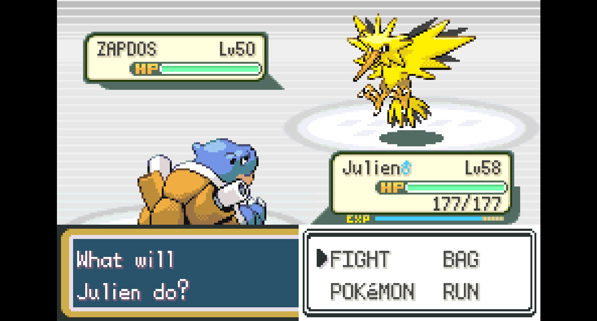
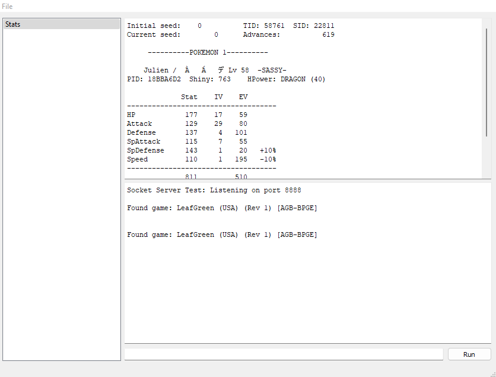
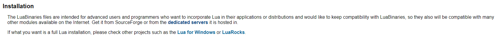
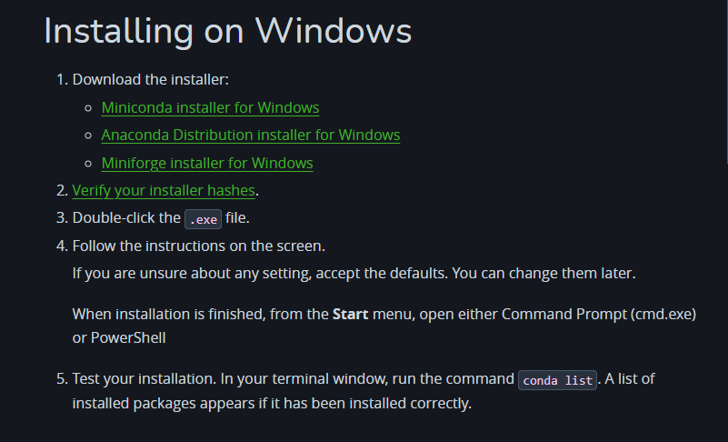
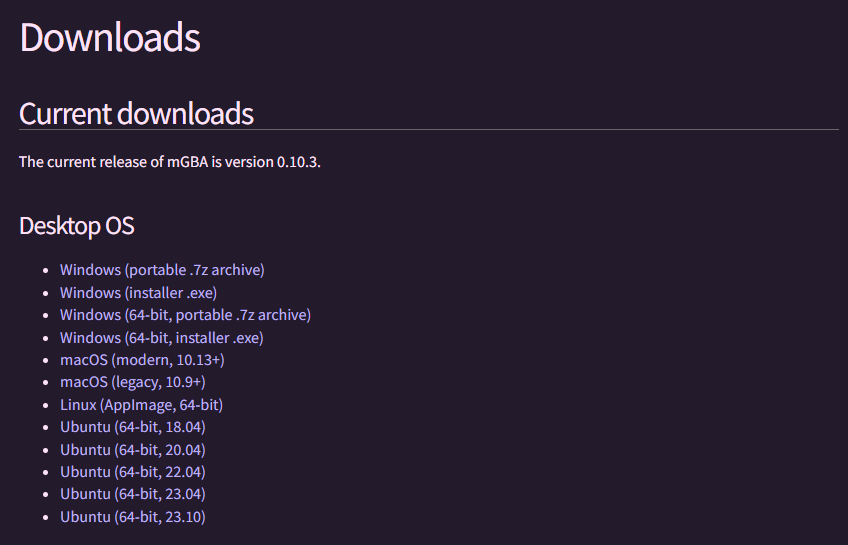
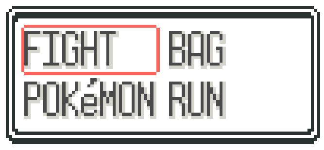
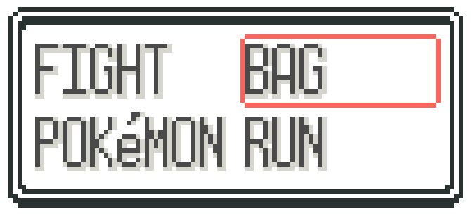

## 3rd Gen Random Encounters

3rd Gen Random Encounters is a combination of Lua and Python scripting that automates the process of random encounter shiny hunting via either pacing or the Acro Bike. This is accomplished by inputting repetitive movements, then template matching for specific images, and finally checking if the SID is less than 8. *Note: Even though Emerald's RNG is broken, this process still works on standard odds since it is executing long term on the same instance.*

<div style="display: grid">


</div>

---
## 1. Preparation

To run these scripts, you will need both Lua and Python Conda installed on your computer. You may need several other libraries as well, including Lua Socket, OpenCV, and PyAutoGUI, depending on the version of Lua/Python you have downloaded. You will also need to download GameBoy emulator mGBA, since we will be taking advantage of its scripting capabilities.


<div style="display: grid;">


</div>

---
## 2. Installation

All you need to do for installation is download the zip file from this repository. Store the contents wherever you please.

---
## 3. Customization

There are several lines in the Python script that are customized to my inputs and graphical settings, so you will most likely have to make small alterations before continuing. First, check if my button mapping match yours.

```
pydirectinput.press("z")
pydirectinput.press("x")
pydirectinput.keydown("ctrl")
pydirectinput.press("r")
pydirectinput.keyup("ctrl")
pydirectinput.keydown("enter")
pydirectinput.press("left")
pydirectinput.keyup("enter")
```

*Z = A, Enter = Start, Left = Left Arrow, Ctrl + R = Reset*

Next, you will want to take two pictures of your fight box (one with the arrow/box over Fight, and the other arrow/box over Bag) and save it as *fightBox.png* and *fightBoxRight.png* for Fire Red/Leaf Green/Emerald or *fightBoxRS.png* and *fightBoxRightRS.png* for Ruby/Sapphire in the assets directory. This is because in-game settings and emulator settings may vary from user to user. Please open my original image before saving over it for an example of what the image is supposed to be.




Your fight box image will impact the value of *thr*, A.K.A the template matching threshold in the function *matchTemplate(img,template)*. This value is higher for a more strict threshold and lower for a less strict threshold of matching your fight box to the current screenshot. Ideally, it would return a positive match for the fight box screen but would fail against the subsequent box containing your Pokemon's moves. Since we reset before getting to the second box in the vanilla version of this script, this would only matter if you wish to alter the script further.

```
def matchTemplate(img, template):
    result = cv2.matchTemplate(img, template, cv2.TM_SQDIFF_NORMED)
    min_val = cv2.minMaxLoc(result)[0]
    thr = .05
    return min_val <= thr
```

The last and smallest options for customization are the timer and the sound clip. There is a 1.5 second delay to ensure accurate template matching and a quick input process. You may need to adjust this higher or lower depending on your emulation speed. For reference, my emulator runs at 60 fps.

```
time.sleep(1.5)
```

Lastly, there is a sound clip that plays after you catch a shiny on Line 111. If you wish to disable that, simply delete it or comment it out.

```
playsound("./assets/shinysound.mp3",block=False)
```

---
## 4. Execution

After the installation/customization is complete, it is finally time for execution.

1.  Launch your game on the mGBA emulator and navigate to your hunting location. If you are running in Horizontal/Vertical mode, position your character in such a way that you will bonk between two walls (preferably with three or more tiles on either side). If you are running in Acro mode, make sure you have your Acro Bike out and are standing on a tile where encounters can spawn.
2.  First, load the script by navigating to Tools > Scripting. Select File > Load Script in the pop up window and select *main.lua*.
3.  Next, either run the script *main.py* from a terminal or your IDE.
4.  Enter your desired mode, and then re-navigate over to your mGBA window. Leave the window in focus and you are good to go!

You will have about 5 seconds before your first action, which should give you plenty of time. Side note: the mGBA scripting window indicates that you can press Shift + Left or Shift + Right to view different Pokemon. Do not do this or else your next encounter will be invalidated. Happy hunting :3
